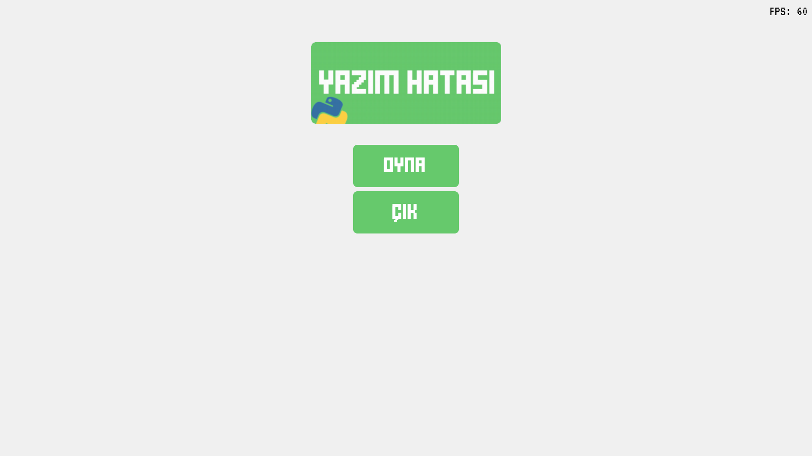
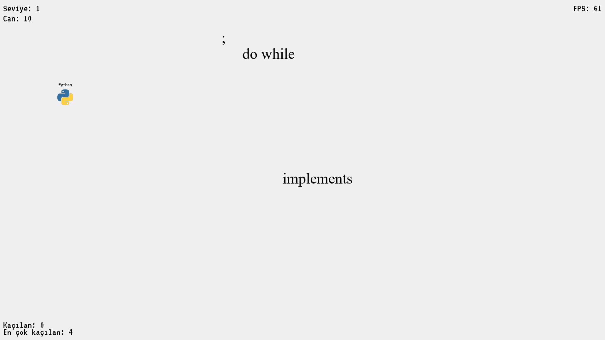

# Yazım Hatası Oyunu

---

### Oyun Hakkında

Oyunun **ana amacı**; normalde Python'da mevcut olmayan anahtar kelimeler, operatör vesaire şeylerden sıyrılmalısınız (dodge). 😃

Oyun, **yön tuşları** veya **WASD** ile oynanır. Ve **SHIFT** tuşuna basılarak hızlı gidilebilir.

Her **50 hata**dan kaçtığınızda ekstra **5** can kazanırsınız.

İyi oyunlar!
