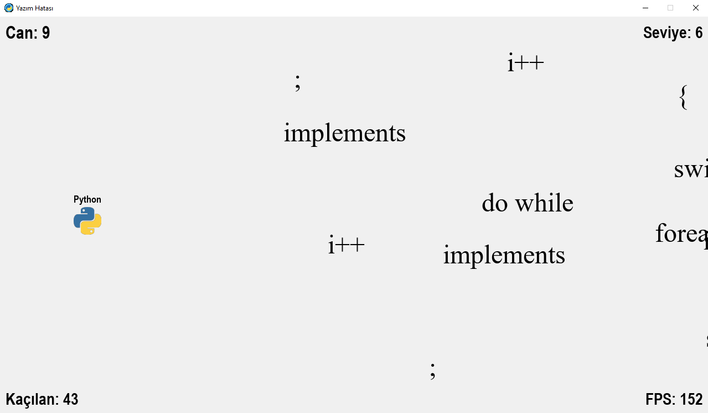
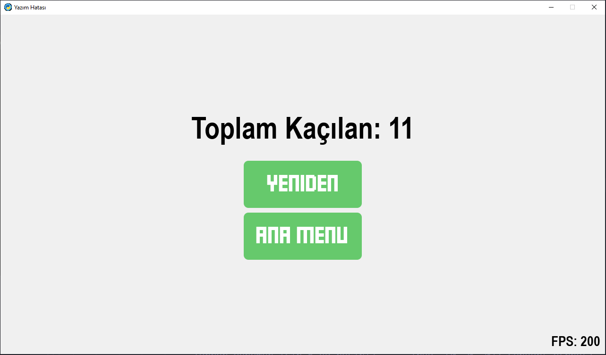

# Yazım Hatası Oyunu

---




### Oyun Hakkında
Oyunun **ana amacı**; normalde Python'da mevcut olmayan anahtar kelimeler, operatör vesaire şeylerden sıyrılmalısınız (dodge). 😃

Oyun, **yön tuşları** veya **WASD** ile oynanır. Ve **SHIFT** tuşuna basılarak hızlı gidilebilir.

Her **50 hata**dan kaçtığınızda ekstra **5** can kazanırsınız.

### Kendi Adımı Yazmak İstiyorum?
Bunun için `app.py` adlı dosyanın içindeki `name` değişkenini değiştiriniz.

>app.py
```python
import sys

from util import terminal
from util.game import Game


def main(*args: list, **kwargs: dict) -> None:
    """Oyunun ana kalkış noktası"""

    # Ekranı temizle.
    terminal.clear()

    name: str = "Python"

    # Oyun objesi oluştur. Bu sayede oyun başlayacak.
    game: Game = Game(name)


# Oyunu başlat!
if __name__ == "__main__":
    main(sys.argv)

```

### Oyunu Çalıştır

**Windows** kullanıcıları bu yolu seçecek.
```bath
python app.py
```

**Linux** veya **MacOS** kullananlar ise bunu...
```bath
python3 app.py
```

### Gerekli Python Versiyonu ve Kütüphaneleri
* Python==3.8.2
* Pygame==1.9.6

### Kütüphaneleri Kurmak

**Windows** kullanıcıları kühüphane kurarken **pip** kullanmalı.
```bash
pip install pygame==1.9.6
```

**Linux** kullanıyorsanız, kullandığınız dağıtıma göre bir kullanım seçmelisiniz. Linux'da pip kullanımı öğrenmek için [buradan](https://www.tecmint.com/install-pip-in-linux/) kopya çekebilirsiniz 😃

Örneğin **Ubuntu**'da böyle...
```bash
sudo apt-get install python-pygame==1.9.6
```

**MacOS** kullanıcıları [buraya](https://sourabhbajaj.com/mac-setup/Python/pip.html) göz atabilir.

### Windows Kullanıyorum ve Python Kurulu Değil?
Bi' zahmet [buradan](https://www.python.org/) hallediverin.
