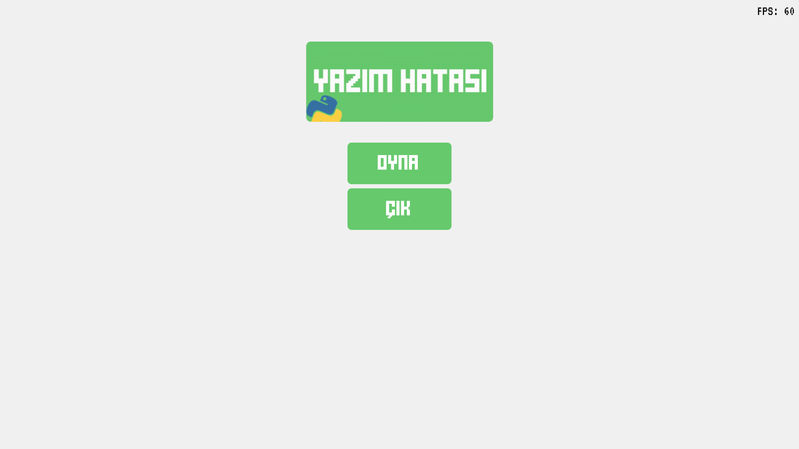
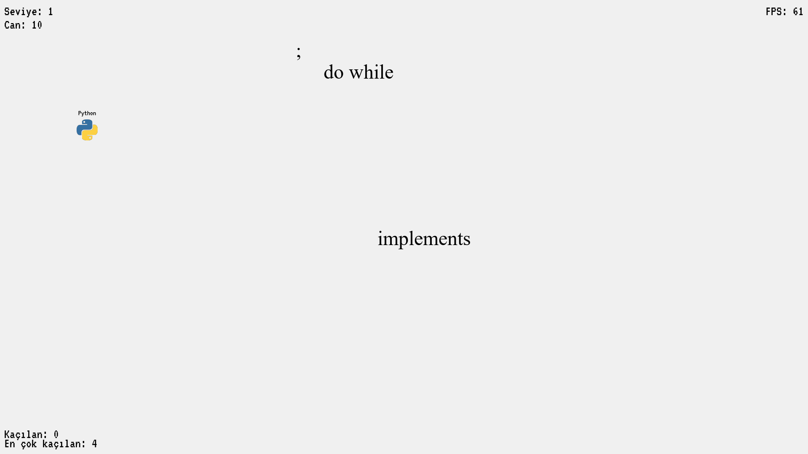

# Yazım Hatası Oyunu

---




### Oyun Hakkında

Oyunun **ana amacı**; normalde Python'da mevcut olmayan anahtar kelimeler, operatör vesaire şeylerden sıyrılmalısınız (dodge). 😃

Oyun, **yön tuşları** veya **WASD** ile oynanır. Ve **SHIFT** tuşuna basılarak hızlı gidilebilir.

Her **50 hata**dan kaçtığınızda ekstra **5** can kazanırsınız.

### Oyunu Çalıştır

Öncelikle sanal ortamı oluşturalım...
```bash
python3 -m pip install virtualenv
python3 -m virtualenv venv
```

Linux ve macOS için sanal ortamı çalıştır
```bash
source venv/bin/activate
```

Windows için sanal ortamı çalıştır
```bash
venv\Scripts\activate
```

Daha sonra ise gerekli kütüphaneleri kuralım
```bash
python3 -m pip install -r requirements.txt
```

Son olarak oyunu çalıştırmak kaldı... İyi eğlenceler :)
```bash
python3 play.py
```
